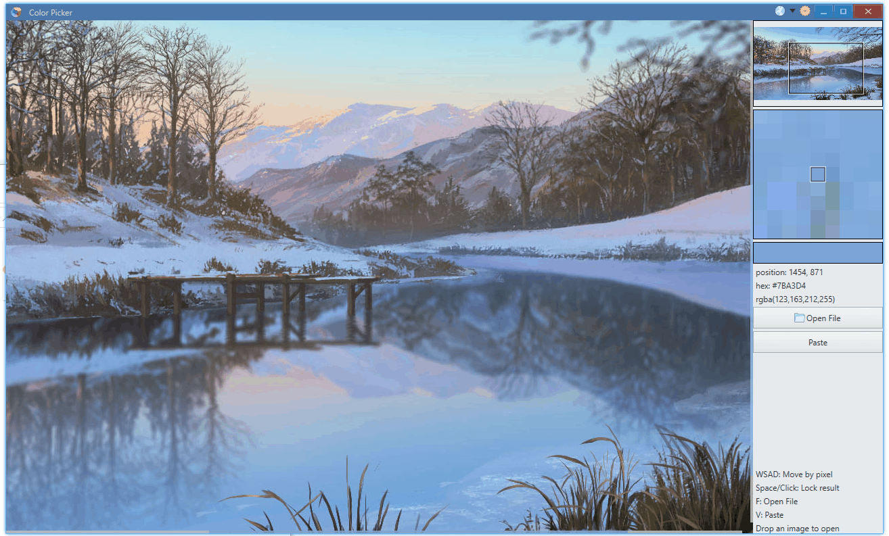
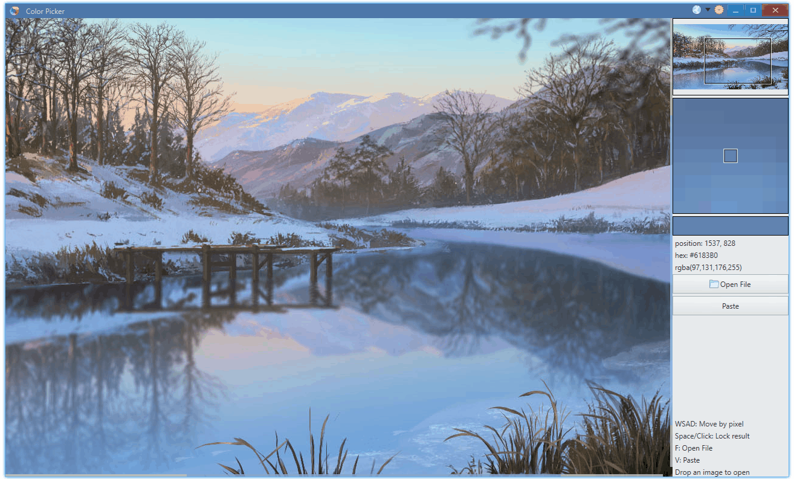

<p align="center">
    
</p>

<h1 align="center">Color Picker</h1>

English | [简体中文](./README_zh-cn.md)

# Introduction

This is the tutorial project of [Avernakis UI](https://github.com/qber-soft/Ave-Nodejs). 

Tiny, but production ready.


# Features

-   basic controls: button, label, icon, toolbar, ...
-   custom component: mini view, pixel view
-   event: mouse, keyboard
-   hot key / shortcut

-   drag to drop



-   clipboard


-   theme


-   i18n



## Dev

```bash
> npm install
> npm run dev
```

## Package

```bash
> npm run release
```

## License

[MIT](./LICENSE)
